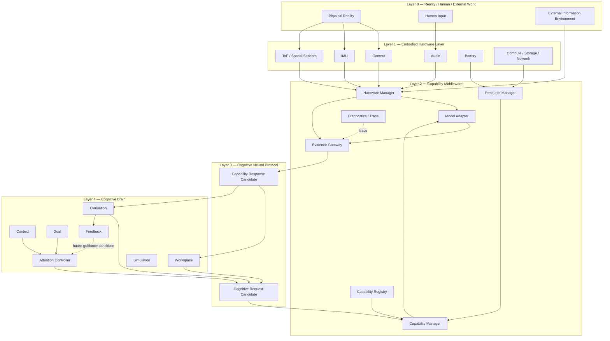

# Cognitive Middleware Overall Architecture v1

## Phase

- Phase: `Phase-Cognitive-Middleware-Rearchitecture-Architecture-Map-v1-001`
- Execution mode: Planning Only / V0.
- Scope: architecture map and responsibility boundaries only.
- Non-goals: no code, runtime, model, hardware, or directory migration.

## Purpose

Luna Cognitive Middleware is the controlled capability-supply layer between the Cognitive Brain and the embodied/external world. It answers **how an admitted capability can provide evidence**. It does not answer why Luna should think, what goal should be pursued, or what is true.

## Layered architecture

## Direction of authority

| Layer | Owns | Does not own |
|---|---|---|
| L0 Reality | Reality itself | Luna's interpretation of reality |
| L1 Embodiment | Sensor/device availability and physical limits | Cognitive goal, truth, decision |
| L2 Middleware | Capability discovery, selection support, resource/lifecycle management, evidence packaging, diagnostics | Goal, attention, fact/truth, decision, action authority |
| L3 Neural Protocol | Candidate-shaped request/response exchange | API execution semantics or State mutation |
| L4 Cognitive Brain | Context, goal, information need, attention, workspace reasoning, evaluation, feedback candidates | Direct hardware/model invocation, direct action |

## Primary flow

`Brain information need → Cognitive Neural Protocol request → Middleware capability preparation → embodied/model capability result → Evidence Gateway → Evidence Candidate → Brain evaluation`

No layer may collapse this into `model output → decision` or `brain module → device call`.

## Status

`COGNITIVE_MIDDLEWARE_OVERALL_ARCHITECTURE_READY_WITH_NOTES`

`WAITING_FOR_USER_TERMINAL_VERIFICATION`
