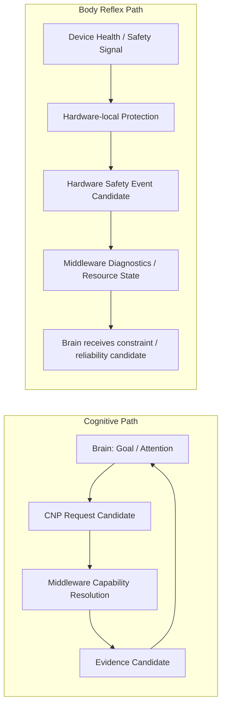

# Cognitive Middleware Reflex Boundary Model v1

## Purpose

Middleware must not wait for high-level cognition to protect a failing physical capability. At the same time, a local safety response must not become an uncontrolled action system. This model separates **Cognitive Control** from **Body Reflex**.

## Two paths

## Reflex boundary

| Event | Local protective response | Middleware role | Brain role | Forbidden |
|---|---|---|---|---|
| Camera thermal limit | sensor/device throttles or disables its own acquisition path | package health/resource/failure candidate | reallocate attention or request alternate evidence candidate | wait for Brain approval before device self-protection; treat it as truth/decision |
| Battery critically low | power subsystem protects device operation | report resource constraint candidate | revise cognitive request / attention allocation candidate | select an external action or silently rewrite goal |
| Storage full | local write protection / bounded retention policy | report capacity/diagnostic candidate | reduce evidence need or defer candidate | delete cognitive memory or State autonomously |
| Sensor failure | device marks path unavailable / fails safe | emit capability-unavailable/failure candidate | evaluate uncertainty and alternative evidence need | fabricate evidence or continue to claim capability availability |

## Frozen distinction

**Body Reflex** is a constrained embodiment-protection event. It may protect the device itself in a future approved hardware safety boundary. It is not:

- a Decision;
- an Action in the external world;
- a navigation instruction;
- a Goal override;
- a fact judgment;
- a Cognitive State mutation.

Middleware does not itself gain reflex authority. It receives health signals, records diagnostics, exposes resource/reliability/failure candidates, and mediates their visibility to the Brain.

## Status

`COGNITIVE_MIDDLEWARE_REFLEX_BOUNDARY_MODEL_READY_WITH_NOTES`

`WAITING_FOR_USER_TERMINAL_VERIFICATION`
