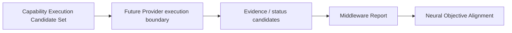

# Cognitive Middleware Report Model v1

## Purpose

A Middleware Report is the execution-side account of what candidate coverage was delivered, constrained, missing, degraded, or conflicted for a CWO. It is a report to Neural Governance, not a claim that the cognitive objective is complete.

## Canonical fields

| Field | Meaning |
|---|---|
| `work_objective_ref` | CWO and parent trace reference. |
| `completed_coverage` | Evidence/relationship coverage reported as delivered. |
| `missing_coverage` | Required coverage not delivered or not available. |
| `conflict` | Evidence/status conflict candidates with provenance. |
| `failure` | Provider/session/contract failure candidates. |
| `degradation` | Quality, resource, health, or scope limitation candidates. |
| `unknown_remaining` | Unknowns still not addressed by reported coverage. |
| `alternative_candidate` | Feasible alternative capability/decomposition candidate. |
| `resource_status` | Resource/session condition reference. |
| `trace` | Execution-candidate, evidence, status, and lifecycle ancestry. |

## Explicit prohibitions

The report must not output:

- Truth;
- Decision;
- Cognitive Completion;
- Goal replacement;
- Attention allocation;
- Action;
- State mutation.

“Completed coverage” means a declared work dimension has returned status/evidence according to its contract. It does not mean the evidence is true, the Brain understands enough, or the objective should be closed.
