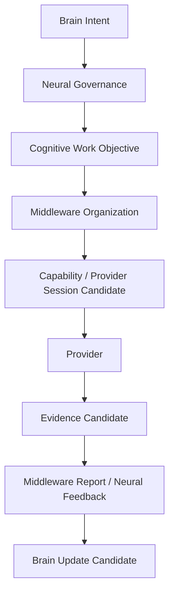

# Cognitive Middleware Whitebox Reintegration v1

## Purpose

The existing Model Test Lens and trace/replay assets should evolve into a Cognitive Whitebox projection. It must explain the full cognitive-to-capability chain, not merely list model invocations or expose a control endpoint.

## Existing whitebox assets

`capabilities/midplatform/model_test_lens/static_site/` already includes model panels, multi-model interaction, observation-attention views, perception HUD, runner bridge, controlled runner panels, result layers, and situation-understanding trace views.

## Reintegration design

| Existing presentation concern | Cognitive Whitebox projection |
|---|---|
| Model panel | Provider detail nested under a capability execution candidate. |
| Multi-model collaboration | CWO coverage and capability-composition rationale. |
| Observation attention panel | Brain/Neural attention requirement and evidence scope; not UI-side authority. |
| Runner bridge / controlled runner | Future Provider Session admission/status surface, never direct cognitive control. |
| Result layer | Evidence Candidate with source, uncertainty, conflict, and scope. |
| Situation-understanding view | Brain Update Candidate / feedback lineage, not provider conclusion. |
| Trace/replay | End-to-end Intent → CWO → middleware → evidence → feedback timeline. |

## Required trace fields

`intent_ref`, `cwo_ref`, `capability_requirement_ref`, `provider_candidate_ref`, `session_ref`, `evidence_ref`, `middleware_report_ref`, `neural_feedback_ref`, `source`, `destination`, `lifecycle`, `authority_envelope`, and `provenance`.

The whitebox remains a future local UI design. This phase does not change the existing site, bridge, runner, or diagnostics code.
