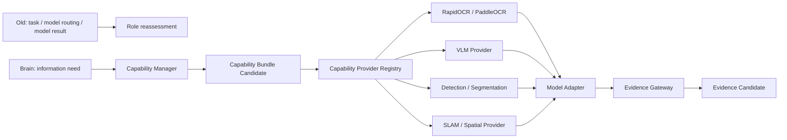

# Model Adapter Rearchitecture v1

## Repositioning

The former Model Manager-centered approach is replaced in the cognitive path by a capability-centered provider layer.

## Role mapping

| Previous asset/role | New position | Treatment | Reason |
|---|---|---|---|
| Model Manager | Capability Provider Manager | `MIGRATE` | Manages provider registration, lifecycle, health, and capability metadata; does not make cognitive selections. |
| Model Router | Provider resolution subfunction | `REPLACE` in cognitive path | Resolves feasible provider only after Attention/Brain expresses an information need. |
| Model evaluation engine | Provider diagnostics/reliability source | `MIGRATE` | Supplies latency, health, accuracy/reliability observations as candidates. |
| Provider-specific adapters | Model Adapter | `MIGRATE` | Normalizes provider I/O but does not produce cognitive truth. |
| OCR/detection/SLAM/VLM output | Evidence Gateway input | `MIGRATE` | Converts raw output into source-scoped Evidence Candidate. |

## Capability-first selection example

For airport navigation, Brain requests `text evidence for gate confirmation` with high priority and low-power constraints. Middleware may return alternatives:

| Capability Candidate | Provider | Expected trait | Boundary |
|---|---|---|---|
| A | OCR | low-power, text-focused, fast | candidate only; not automatically invoked |
| B | VLM | broader semantic interpretation, higher cost | candidate only; not automatically invoked |
| C | audio/ASR | public announcement evidence if available | candidate only; not automatically invoked |

Capability Manager does not ask “which model is strongest?” as a cognitive policy. It asks “which registered provider/bundle can satisfy the admitted evidence requirement within the declared resource constraints?”

## Adapter constraints

- Model Adapter receives only a future admitted provider request, never direct Brain control.
- Model Adapter output is raw normalized capability output plus reliability metadata.
- Evidence Gateway is responsible for producing the cognition-facing Evidence Candidate.
- Provider fallback/degradation creates capability/resource/failure candidates; it cannot alter Goal or Attention directly.

## Status

`COGNITIVE_MODEL_ADAPTER_REARCHITECTURE_READY_WITH_NOTES`

`WAITING_FOR_USER_TERMINAL_VERIFICATION`
