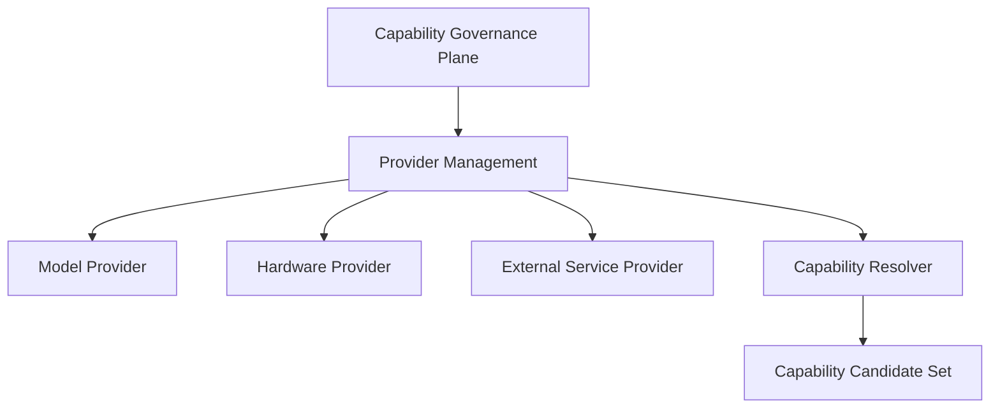

# Model Manager Migration v2

## Repositioning

Model Manager is not removed. Its Cognitive Middleware placement changes from a potential control center to a **Provider Management** asset inside Capability Governance Plane.

## Role mapping

| Old Model Manager concern | Future placement | Treatment | Boundary |
|---|---|---|---|
| Provider registry/loading | Provider Management | Reuse | Describes providers; cannot originate Brain task. |
| Capability-first routing | Capability Resolver input | Reuse with narrowed role | Resolves feasible provider after Neural Capability Signal; cannot create Attention. |
| Ownership/resource evaluation | Resource/Contract validation input | Reuse | Returns feasibility/constraint candidates only. |
| Model admission/lifecycle | Admission and Lifecycle governance input | Reuse | Registration/admission is not invocation. |
| Health diagnostics | Diagnostics | Reuse | Returns reliability/failure candidates; no truth evaluation. |
| “best model” selection | Removed as cognitive policy | Replace role | Resolver compares contract/resource fit, never declares a cognitive answer. |

## Provider principle

`Model ≠ Capability.`

A capability is the governed, contract-bound ability Luna may request, such as text evidence generation. RapidOCR, PaddleOCR, or a VLM are providers that may satisfy that capability under different constraints. A provider cannot become a Goal, Attention, Decision, or Truth authority merely because it is available or highly scored.

## Status

`COGNITIVE_MODEL_MANAGER_MIGRATION_V2_READY_WITH_NOTES`

`WAITING_FOR_USER_TERMINAL_VERIFICATION`
