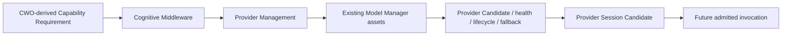

# Model Manager–Provider Management Runtime Boundary v1

## Purpose

This document freezes how the existing Model Manager assets may be projected into future Provider Management without granting Model Manager a runtime cognitive-control role.

## Reused Model Manager capabilities

| Existing capability | Provider Management projection | Runtime boundary |
|---|---|---|
| Capability matcher | Matches CWO-derived requirement to registered capability/provider roles. | Cannot originate a requirement. |
| Admission processor | Verifies Provider eligibility. | Does not invoke the Provider. |
| Resource evaluator | Supplies feasibility and constraint candidate. | Does not allocate Brain attention. |
| Routing candidate builder | Produces Provider Candidate Set/preference candidate. | Does not make cognitive/model execution decision. |
| Lifecycle planner | Reports availability/degradation/suspension condition. | Does not open a session. |
| Fallback planner | Produces alternative Provider Candidate. | Does not auto-retry. |
| Diagnostics/trace/replay | Projects health, provenance, and replay references. | Does not mutate state or control Brain. |

## Future runtime admission boundary

Only a separately approved Controlled Model Invocation Skeleton may turn a protocol-valid Provider Session Candidate into an admitted invocation. That future boundary must preserve CWO trace, registry/admission checks, explicit resource constraints, Evidence Gateway return, failure reporting, and no direct Provider-to-Brain link.

This phase neither modifies Model Manager nor creates Provider Management Runtime behavior.
