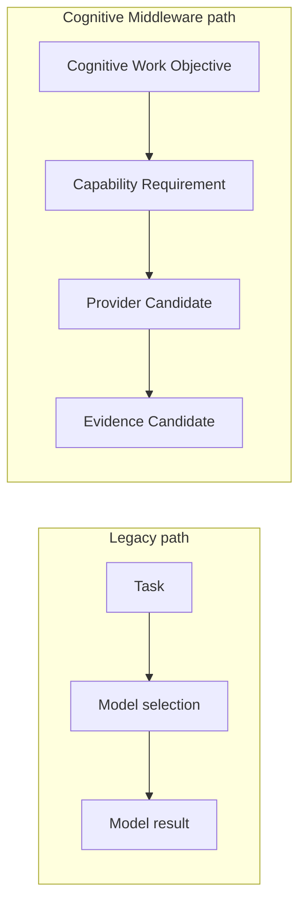

# Model Manager to Provider Management Migration v1

## Current asset finding

The existing `capabilities/midplatform/model_manager/` already provides reusable capability matching, eligible-provider registry views, admission checks, ownership/resource evaluation, routing candidates, lifecycle planning, fallback candidates, health diagnostics, and trace/replay. Its present API is capability-oriented but still accepts legacy task references and produces a selected-model candidate.

## Repositioning

| Legacy responsibility | Provider Management future role | Boundary adjustment |
|---|---|---|
| Model registry view | Provider Registry view. | Model is a Provider, not a cognitive subject. |
| Capability matcher | Capability Requirement matching. | Requirement originates from CWO/Middleware decomposition. |
| Admission processor | Provider eligibility/admission gate. | Admission does not imply invocation. |
| Resource evaluator | Provider/resource feasibility report. | Cannot set Goal or Attention. |
| Routing/selected-model candidate | Provider Candidate Set / preferred candidate. | Candidate is not automatic execution. |
| Fallback planner | Alternative Provider Candidate Set. | Cannot rewrite CWO purpose. |
| Health/lifecycle diagnostics | Provider Status and degradation candidates. | Status is not cognitive completion. |
| Trace/replay | Provider-session trace projection. | Must join CWO and Neural trace lineage. |

## Target authority

Provider Management is owned by Cognitive Middleware. It receives a capability requirement derived from CWO decomposition and returns provider, reliability, resource, lifecycle, fallback, and status candidates. It must not determine a task, cognitive goal, attention allocation, truth, decision, action, or Brain update.

## Migration result

`Model Manager → Provider Management` is a semantic repositioning and adapter mapping, not a code rewrite in this phase.
