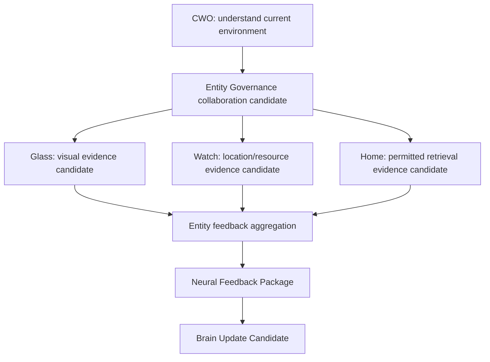

# Multi-Entity Collaboration Model v1

## Purpose

Multi-Entity Collaboration describes how distinct embodiment nodes may contribute complementary evidence to one CWO while maintaining one Brain and one coherent cognitive authority boundary.

## Collaboration contract

| Entity contribution | Permitted output | Forbidden output |
|---|---|---|
| Glass | Local visual/status evidence candidates. | A separate world conclusion or Goal. |
| Watch | Local position/resource/sensor candidates. | Attention allocation or action command. |
| Home | Scoped retrieval or environment-service evidence candidates. | Memory authority or cognitive completion. |

## Rules

1. All contributions retain entity, capability, time, scope, and trace provenance.
2. Conflicts between entities remain explicit Conflict Candidates.
3. Collaboration increases evidence coverage; it never creates multiple Brains or entity-specific personalities.
4. Entity-local caches remain local and may not become independent long-term Experience.
5. Final semantic evaluation remains candidate-based in the Brain pathway after Neural aggregation.

No distributed cognition runtime, consensus algorithm, or entity execution implementation is created in this phase.
