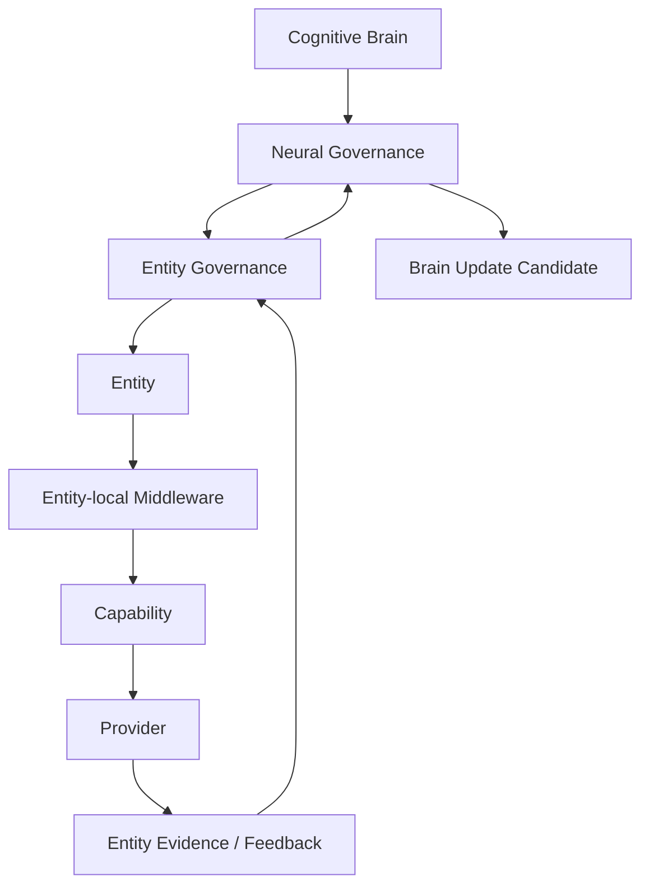

# Multi-Entity Whitebox Architecture v1

## Purpose

The future whitebox must expose one cognitive subject coordinating multiple embodied nodes. It should show ownership, routing rationale, local constraints, and feedback provenance—not a collection of disconnected device logs.

## Required views

| View | Display |
|---|---|
| Brain ownership | Single owner-Brain reference, intent/CWO lineage, no entity personality. |
| Entity roster | Entity identity, embodiment type, trust/connection state, advertised capability roles. |
| Routing | CWO scope, Entity Routing Candidate Set, capability/resource/availability rationale. |
| Local organization | Entity-local Middleware situation report and execution candidate boundary. |
| Collaboration | Complementary coverage, conflicts, timing/scope alignment, and missing coverage. |
| Feedback | Entity feedback → Neural package → Brain update candidate provenance. |
| Local autonomy | Health/reflex/resource events visibly separated from Goals, Decisions, and Actions. |

## Display invariants

- Every Entity is labelled as an embodiment node, not a Brain or Agent.
- Provider output remains Evidence Candidate output.
- Routing and collaboration remain candidates, not automatic execution.
- No visualization may imply Entity access to Brain Memory, Value, Goal, or Reducer mutation.
