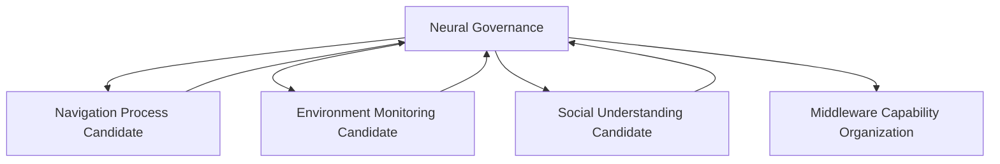

# Multi Process Coordination Model v1

Multiple process candidates may coexist, for example Navigation, Environment Monitoring, and Social Understanding. They share Brain Context, Reality Evidence, and Attention Governance, but cannot directly negotiate, mutate each other, or form an autonomous federation.

Coordination distinguishes cognitive priority, resource priority, and risk priority. None implies Decision authority or a Scheduler.
