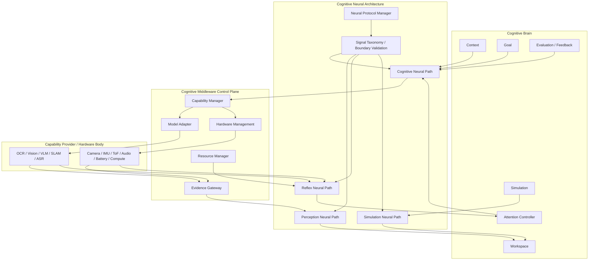

# Cognitive Neural Architecture Overview v1

## Phase and position

- Phase: `Phase-Cognitive-Neural-Architecture-Planning-v1-001`
- Execution mode: Planning Only / V0.
- Cognitive Neural Architecture is an independent information-transport, classification, governance, and adaptation layer.
- It is not Cognitive Brain, Cognitive Middleware, a Capability Provider, or a Runtime.

## Architectural purpose

The Brain forms cognitive intention; the Neural Layer carries and regulates candidate-shaped signals; Middleware resolves bounded capability; the embodied/external layer supplies raw capability results and health feedback. The Neural Layer gives these exchanges a stable signal vocabulary, compatibility boundary, trace form, and authority contract.

## Neural Layer authority

The Neural Layer may:

- transport signals between bounded layers;
- classify signals by type, direction, urgency, lifecycle, and authority envelope;
- validate signal boundary/compatibility/trace requirements;
- adapt signal representation through approved candidate-compatible versions;
- expose signal feedback for Brain and Middleware consumption.

The Neural Layer may not own:

- Goal Authority;
- Decision Authority;
- Truth Authority;
- Action Authority;
- Runtime execution authority;
- Reducer/State mutation authority.

## Status

`COGNITIVE_NEURAL_ARCHITECTURE_OVERVIEW_READY_WITH_NOTES`

`WAITING_FOR_USER_TERMINAL_VERIFICATION`
