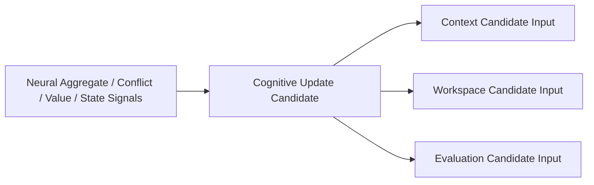

# Neural–Brain Feedback Interface v1

## Interface

Neural Layer returns a **Cognitive Update Candidate** after aggregation and signal-value processing. The Brain may use it as an input to Context, Workspace, and Evaluation; Neural Layer cannot write any of those objects directly.

## Update contents

| Component | Meaning | Boundary |
|---|---|---|
| `evidence_refs` | evidence/aggregate candidate references | does not promote evidence to fact |
| `consistency_ref` | support/contradiction candidate reference | does not resolve conflict as truth |
| `alignment_ref` | temporal/spatial alignment candidate reference | does not change world state |
| `signal_value_ref` | relevance/gain/reliability/cost/uncertainty-reduction candidate | does not allocate Attention |
| `resource_reliability_refs` | delivery constraints and health information | does not rewrite goal/self state |
| `feedback_requirement_status` | requested feedback was/was not satisfied | does not create a new task |
| `trace_ref` | full neural lifecycle lineage | not persistent State |

## Brain consumption rule

Context, Workspace, and Evaluation treat Cognitive Update Candidate as a candidate source. Any cognitive update remains subject to existing Context, Attention, Sufficiency, Evaluation, Governance, and Reducer boundaries.

## Status

`COGNITIVE_NEURAL_BRAIN_FEEDBACK_INTERFACE_READY_WITH_NOTES`

`WAITING_FOR_USER_TERMINAL_VERIFICATION`
