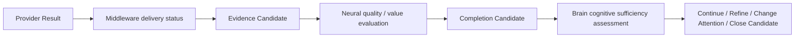

# Cognitive Neural Completion Evaluation v1

## Purpose

Neural Completion Evaluation distinguishes delivery completion, signal adequacy, and cognitive sufficiency so that no Middleware component silently acquires cognitive authority.



## Three separate judgments

| Layer | May assess | Must not assess |
|---|---|---|
| Middleware | Whether a capability session delivered, failed, degraded, or exhausted its resource limit. | Whether the Brain's cognitive information need is satisfied. |
| Neural | Signal quality, coverage, alignment, conflict, relevance, information value, and uncertainty-reduction candidate. | Truth, goal selection, final decision, or action. |
| Brain | Whether current evidence and understanding are cognitively sufficient for the active goal/context. | Direct provider/hardware control or reality confirmation. |

## Neural Completion Candidate

```text
NeuralCompletionCandidate {
  parent_intent_ref,
  delivery_status_ref,
  coverage_candidate,
  quality_candidate,
  conflict_candidate,
  information_value_candidate,
  uncertainty_reduction_candidate,
  completion_recommendation,
  trace
}
```

`completion_recommendation` may be `continue_candidate`, `refine_candidate`, `change_attention_candidate`, or `close_candidate`. It is never a Decision, Action, Truth, or State Mutation.

## Evaluation criteria

- **Coverage:** Were the observation and relation requirements addressed?
- **Quality:** Is the received signal usable within declared reliability limits?
- **Alignment:** Are temporal and spatial scopes compatible with the request?
- **Conflict:** Are conflicting evidence candidates explicit rather than hidden?
- **Value:** Did evidence reduce the requested uncertainty enough to justify its cost?
- **Constraint compliance:** Did the request stay inside time, resource, safety, and scope bounds?

## Frozen boundary

Middleware completion is operational delivery completion only. Neural completion is signal adequacy only. Cognitive completion remains a Brain-level candidate assessment, with no Decision or Action runtime in this phase.
