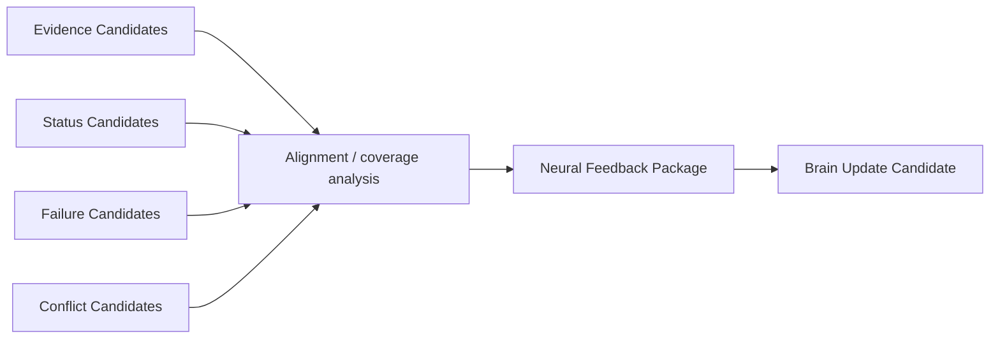

# Cognitive Neural Feedback Aggregation Model v1

## Purpose

Feedback Aggregation turns returned Evidence, delivery status, failures, and conflicts into a single trace-linked **Neural Feedback Package** for Brain consumption. It makes uncertainty and disagreement visible; it does not decide what is real.

## Neural Feedback Package

| Field | Meaning |
|---|---|
| `coverage` | Candidate indication of observation/relation requirement coverage. |
| `confidence` | Source-reported or aligned reliability/confidence metadata; not truth probability. |
| `conflict` | Explicit incompatible, incomplete, temporal, or spatial conflict candidates. |
| `unresolved_unknown` | Unknowns still material to the parent intent. |
| `information_gain_candidate` | Candidate estimate of useful uncertainty reduction. |
| `delivery_status` | Capability-session status reference supplied by Middleware. |
| `failure` | Failure/degradation references and their declared scope. |
| `trace` | Parent mission, child signals, evidence provenance, and lifecycle references. |

## Aggregation discipline

1. Preserve each Evidence Candidate's provenance and scope.
2. Record consistency, conflict, temporal alignment, and spatial alignment as candidates.
3. Do not collapse disagreement into a single factual answer.
4. Do not synthesize a Situation Fact, Reality Fact, Decision, or Action.
5. Return unresolved unknowns to the Brain so Attention and sufficiency may form new candidates.

The Brain alone integrates this package with Context, Workspace, Evaluation, and Cognitive Sufficiency to form a Brain Update Candidate.
