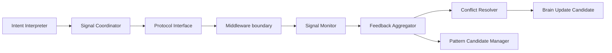

# Cognitive Neural Governance Component Model v1

## Component map

These are logical components for contract ownership and whitebox explanation. They do not prescribe classes, processes, threads, services, or a Runtime implementation.

| Component | Responsibility | Inputs | Outputs | Forbidden authority |
|---|---|---|---|---|
| Intent Interpreter | Read the Brain intent contract and preserve purpose, scope, uncertainty, constraints, and completion condition. | Cognitive Intent Candidate, Context refs. | Interpreted Intent Candidate. | Goal creation, action generation. |
| Signal Coordinator | Form and relate child Neural Signal Candidates. | Interpreted intent, dependency candidates. | Signal set, priority/dependency candidates. | Provider call, attention allocation. |
| Signal Monitor | Observe trace completeness, delivery status, timeout/degradation/failure candidates. | Signal trace, Middleware status. | Supervision candidates. | Execution control, goal cancellation. |
| Feedback Aggregator | Organize evidence/status metadata into a feedback package. | Evidence, status, conflict, failure candidates. | Neural Feedback Package. | Truth or situation assertion. |
| Conflict Resolver | Make conflicts explicit and propose unresolved/clarification candidates. | Conflict candidates, scope/alignment metadata. | Conflict-resolution candidate. | Choosing factual winner. |
| Pattern Candidate Manager | Form future organizational-pattern candidates from validated trace feedback. | Repeated feedback candidates. | Pattern Candidate. | Runtime policy mutation. |
| Protocol Interface | Encode/decode, validate version/trace/authority envelope, and hand off signals. | Packets and protocol contract. | Boundary-valid signal packets. | Middleware resolution or provider execution. |

## Component constraints

- Components communicate through candidate-shaped artifacts.
- Each component retains parent intent and trace provenance.
- Signal priority is a request/coordination candidate, not an Attention allocation.
- The logical model does not introduce a Scheduler or direct execution loop.
