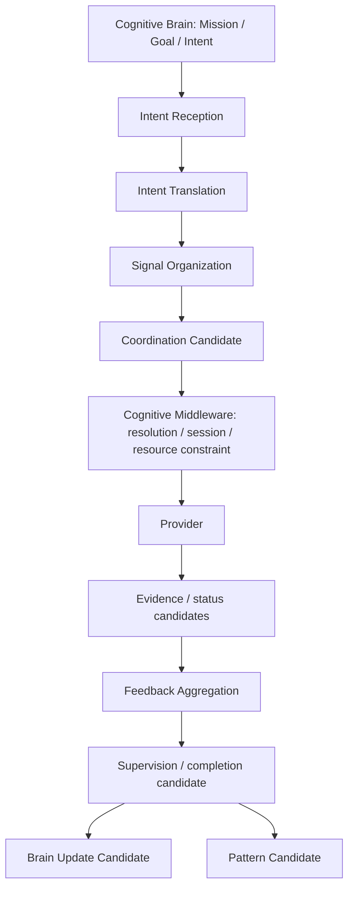

# Cognitive Neural Governance Operating Model v1

## Phase

`Phase-Cognitive-Neural-Governance-Operating-Model-v1-001`  
Execution mode: V0 — architecture planning and static validation only.

## Operating position

Neural Governance is the Cognitive Brain's bounded organization-and-supervision layer for information acquisition. It translates a Brain Cognitive Intent into traceable signal requirements, coordinates candidate-shaped capability needs, supervises their information lifecycle, and returns a structured feedback package.

It is neither a Runtime, Scheduler, Middleware replacement, nor Provider executor.

## Responsibilities

| Responsibility | Neural Governance output | Explicit limit |
|---|---|---|
| Intent reception | Validated parent-intent reference and scope. | Does not create or replace a Goal. |
| Intent translation | Neural Mission Signal and bounded observation/relation requirements. | Does not create Action, movement, or simulation content. |
| Signal organization | Ordered/dependent Signal Candidate set. | Does not invoke a capability. |
| Capability coordination candidate | Required capability domains and coverage candidates. | Does not resolve a provider or allocate resources. |
| Feedback aggregation | Neural Feedback Package with coverage, conflict, reliability, and unresolved unknowns. | Does not produce Reality truth. |
| Supervision | Completion, gap, failure, and signal-integrity candidates. | Does not execute retries or cancel goals. |
| Pattern candidate | Candidate organizational pattern for future validation. | Does not self-modify at runtime. |

## Core operating cycle

`Intent received → translated → organized → coordination candidate emitted → Middleware status/evidence returned → feedback aggregated → supervision candidate emitted → Brain update candidate → optional pattern candidate`

All cycle outputs are candidates. The Brain remains responsible for cognitive sufficiency and attention governance; Middleware remains responsible for capability resolution, Provider sessions, and actual resource constraints.

## Frozen authorities

Neural Governance does not own Goal, Attention, Truth, Decision, Action, Provider invocation, model selection/execution, device control, actual resource allocation, or Reducer state mutation authority.
