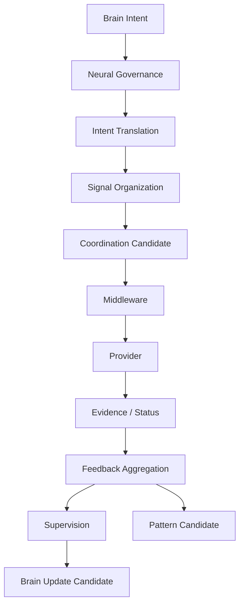

# Cognitive Neural Governance Whitebox v1

## Purpose

The future local whitebox explains how a Brain Intent was organized into information-seeking signals, what constraints/feedback were observed, and what returned to the Brain. It must not reduce the system to a provider-call log.

## Required trace sections

| Section | Visible content |
|---|---|
| Brain Intent | Purpose, context reference, uncertainty target, completion condition, and constraints. |
| Intent Translation | Neural Mission Signal and retained/omitted boundaries. |
| Signal Organization | Child signals, priority/dependency/relationship candidates, and requested coverage. |
| Coordination Candidate | Capability roles and fallback requirements—not model mandates. |
| Middleware boundary | Capability resolution response, resource/degradation/status metadata, and session reference if future-enabled. |
| Provider boundary | Local output references only, always labelled as Evidence Candidates. |
| Feedback Aggregation | Coverage, conflict, confidence/reliability metadata, unresolved unknowns, and information-gain candidate. |
| Supervision | Missing signals, trace issues, degradation, and continue/refine/change-attention/close candidates. |
| Pattern Candidate | Optional future-validation artifact, not immediate adaptation. |

## Trace invariants

- Every stage carries source, destination, lifecycle, authority envelope, and parent trace references.
- The display labels all claims as candidates unless an external validated contract explicitly says otherwise.
- The display contains no action command, Decision result, Reality truth assertion, or hidden State mutation.
