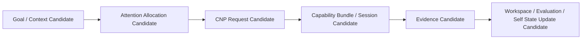

# Cognitive Neural Integration Whitebox Architecture v1

## Purpose

The first Cognitive Whitebox should make Luna's **reason for sensing** observable. It must not be a screen that merely says “YOLO/OCR/VLM was called,” and it must never become a control panel that can alter Brain authority.

## Read-only cognitive trace view

## Proposed whitebox panes

| Pane | Displays | Must not display as authority |
|---|---|---|
| Goal and Context | Goal/context references, unknowns, sufficiency reason | “System objective is final” |
| Attention | source candidates, arbitration, allocation, lifecycle, suppression reasons | a manual priority override |
| Capability Request | information/evidence need, duration, priority, resource constraint | a direct model/device command |
| Middleware Resolution | availability, bundle alternatives, admission/resource constraints | a model recommendation as cognitive decision |
| Session Lifecycle | create/request/active/maintained/reduced/suspended/closed candidates | hidden perpetual capture or task execution |
| Evidence Gateway | source, time, scope, confidence, uncertainty, conflict, trace | evidence as confirmed fact |
| Self State Feedback | capability/resource/reliability change candidates and attention consequences | state mutation or personality/emotion claim |
| Diagnostics | latency, provider/device health, failure candidates, replay trace | runtime control authority |

## Existing asset alignment

The existing Model Test Lens static site and perception/attention/situation panels are the likely UI foundation. Their future migration is read-only:

`Cognitive Trace / Evidence Trace → Whitebox projection → human observation`

not:

`Whitebox UI → Attention / Model / Hardware control`.

## Local web boundary

Future local web access may render synthetic and approved trace data. It must not attach a control endpoint that creates requests, invokes providers, changes session lifecycle, confirms truth, or mutates State. Any later interactive diagnostic design requires its own authority review.

## Status

`COGNITIVE_NEURAL_INTEGRATION_WHITEBOX_ARCHITECTURE_READY_WITH_NOTES`

`WAITING_FOR_USER_TERMINAL_VERIFICATION`
