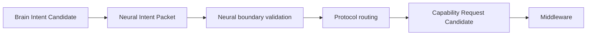

# Cognitive Neural Intent Packet Architecture v1

## Purpose

The Neural Intent Packet is the protocol representation of a Cognitive Intent Candidate. It carries a bounded information requirement from the Brain to the Middleware-facing Neural path without turning the request into a task, model call, or action command.

## Packet model

```text
NeuralIntentPacket {
  intent,
  observation_target,
  attention_requirement,
  relation_requirement,
  depth_requirement,
  uncertainty_target,
  completion_condition,
  resource_constraint,
  trace
}
```

| Field | Contract |
|---|---|
| `intent` | Purpose and bounded information need. |
| `observation_target` | Evidence target, scope, and required observable properties. |
| `attention_requirement` | Requested focus, duration, and priority candidate; not an allocation command. |
| `relation_requirement` | Required spatial, temporal, interaction, or causal-candidate relations. |
| `depth_requirement` | Requested evidence/understanding depth, constrained by the active A-route budget. |
| `uncertainty_target` | Unknown or ambiguity intended to be reduced. |
| `completion_condition` | Candidate sufficiency condition for the information request. |
| `resource_constraint` | Latency, compute, availability, safety, and scope bounds. |
| `trace` | Signal identity, parent references, provenance, lifecycle, and protocol version. |

## Encoding boundary



The packet carries **requirements**. Middleware may produce Capability Candidate Sets under its own resource and provider constraints; it cannot infer new goals or elevate the packet into an action.

## Forbidden content

The packet must not contain:

- Decision
- Action
- Truth assertion
- Provider identifier as a Brain mandate
- Device command, camera command, body command, or movement coordinate
- Future-state or counterfactual simulation result

## Validation rules

1. Every packet has a trace reference and a source Brain context reference.
2. Observation targets are evidence-oriented and scoped.
3. Completion conditions are evaluable as candidate criteria, not facts.
4. Resource constraints may reduce, defer, or reject a request, but cannot silently alter the Brain goal.
5. Decomposition and aggregation preserve the parent packet trace.
