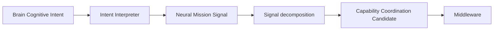

# Cognitive Neural Intent Translation Architecture v1

## Purpose

Intent Translation converts a Brain Cognitive Intent into a Neural Mission Signal that is specific enough for capability organization while preserving the Brain's original cognitive purpose and all non-action boundaries.

## Translation model

| Brain-level expression | Neural Mission Signal expression |
|---|---|
| “Confirm front-road safety.” | `mission: reduce navigation uncertainty` |
| Need to understand vehicle, pedestrian, and road structure relations. | `observation/relation requirements: vehicle relationship, pedestrian relationship, road structure` |
| Need to lower a risk-related unknown. | `uncertainty target: crossing-risk unknown reduction` |
| Stop when evidence coverage is adequate for current context. | `completion candidate: critical relation/unknown coverage threshold` |

## Translation invariants

1. Preserve `intent_purpose`, contextual scope, uncertainty target, completion condition, and resource constraints.
2. Translate toward information requirements, relation coverage, and evidence depth—not movement or action.
3. Emit candidates that may be constrained or rejected by Middleware availability/resource conditions.
4. Preserve trace ancestry from Brain intent to every child signal.

## Forbidden translations

Translation must not produce:

- an Action Candidate;
- a Movement Plan or Motor Command;
- a provider/model mandate;
- a device-control command;
- a future-state simulation;
- a truth assertion;
- a Decision Candidate.

The resulting Neural Mission Signal remains an information-acquisition organization candidate, not a task executor.
