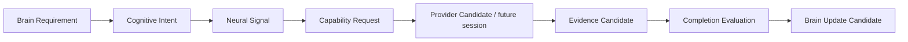

# Cognitive Neural Intent Whitebox v1

## Purpose

The future local whitebox presents the cognitive reason for requesting evidence and the candidate lifecycle—not a raw model-call list.

## Trace object

| Field | Meaning |
|---|---|
| `intent_ref` | Parent Cognitive Intent Candidate. |
| `signal_ref` | Encoded Neural signal reference and protocol version. |
| `source` / `destination` | Layer-to-layer handoff. |
| `observation_requirement` | Evidence coverage requested. |
| `relation_requirement` | Relations being sought. |
| `uncertainty_target` | Unknown intended for reduction. |
| `priority` / `depth` | Allocation request and requested information depth, each candidate-only. |
| `capability_request_refs` | Decomposed capability requirement candidates. |
| `evidence_refs` | Returned Evidence Candidate references. |
| `completion_candidate_ref` | Neural adequacy/coverage result. |
| `lifecycle` | Generated, routed, decomposed, evidence-linked, evaluated, refined, or closed. |
| `provenance` | Parent context, constraints, and trace ancestry. |

## Required whitebox panels

1. **Brain requirement:** why the current information need exists.
2. **Intent packet:** requested observation, relationships, uncertainty reduction, and completion criteria.
3. **Neural processing:** routing and decomposition candidate lineage.
4. **Capability boundary:** candidate set and declared resource/degradation status, never an uncontextualized “model called” event.
5. **Evidence return:** provenance, confidence/reliability metadata, conflicts, and scope.
6. **Completion evaluation:** coverage/value/quality candidates and the Brain update candidate.

## Exclusions

The whitebox must not imply that provider output is truth, that Neural chose a goal, or that an intent generated action. It should label all non-validated outputs as candidates and preserve uncertainty visibly.
