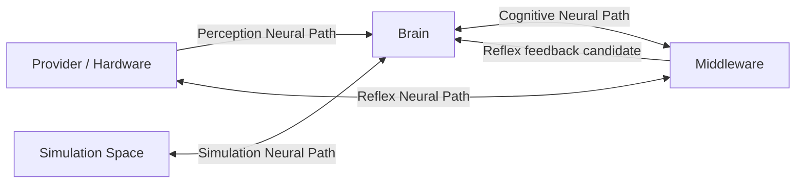

# Cognitive Neural Layer Model v1

## Layer model

Cognitive Neural Architecture comprises four logical paths. A path is a governed direction of signal exchange, not a process, model call, capability executor, or State machine.

| Neural Path | Direction | Carries | Primary purpose | Cannot do |
|---|---|---|---|---|
| Cognitive Neural Path | Brain ↔ Middleware | Goal Context, Attention Request, Capability Request, Resource Negotiation | Express why/what evidence is needed and report feasibility | Define a goal, call a capability, make a decision |
| Perception Neural Path | Body / Provider → Brain | Evidence Candidate, Sensor Information, Observation Feedback | Move source-scoped evidence from body/capability boundary to cognition | Confirm truth, update Context directly, act |
| Reflex Neural Path | Body ↔ Middleware → Brain feedback | Hardware Safety, Resource Protection, Emergency Regulation | Carry local protection/health/resource signals without waiting for a Brain request | Produce World Action or replace Cognitive Decision |
| Simulation Neural Path | Simulation Space ↔ Cognitive Brain | Abstract Body Model, Future Capability Simulation, Counterfactual State | Carry hypothetical internal representations for cognitive evaluation | Access real hardware, become evidence, predict truth |

## Path relationship map

## Path invariants

### Cognitive Neural Path

- Brain sends context-bound intention candidates; Middleware returns capability/resource/reliability/failure candidates.
- A request does not become a device/model command through transport.

### Perception Neural Path

- All cognition-facing provider output enters as Evidence Candidate.
- Source, time, scope, confidence, uncertainty, and trace stay attached.

### Reflex Neural Path

- Hardware-local self-protection may preserve the device within a future embodiment safety contract.
- A reflex signal tells Brain/Middleware about constraints; it cannot command navigation, modify a goal, or move the body in the world.

### Simulation Neural Path

- Simulation is internal hypothetical processing.
- Simulation signals remain separated from Perception/Evidence signals and cannot cross into Reality as fact.

## Status

`COGNITIVE_NEURAL_LAYER_MODEL_READY_WITH_NOTES`

`WAITING_FOR_USER_TERMINAL_VERIFICATION`
