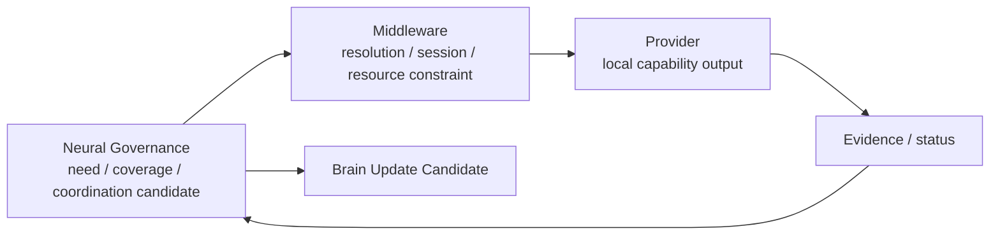

# Neural Governance–Middleware Boundary v1

## Boundary statement

Neural Governance answers **why and what information organization is needed** under a Brain Intent. Cognitive Middleware answers **how available capability can be provided** within contracts, Provider/session state, and hard resource constraints. Providers answer **what local output they can return**.

## Example: road-crossing understanding

| Layer | Permitted expression |
|---|---|
| Neural Governance | “Current intent requires road, vehicle, pedestrian, and relation evidence to reduce safety uncertainty.” |
| Middleware | “Under available contracts and limits, these capability/provider candidates can potentially provide visual/spatial/text evidence; delivery may be degraded.” |
| Provider | “Returns local detection/OCR/spatial output packaged as an Evidence Candidate.” |
| Brain | “Uses the feedback package in Context/Workspace/Evaluation to form a cognitive update candidate.” |

## Strict separation

| Neural Governance must not | Middleware must not |
|---|---|
| Directly select/invoke a Provider; allocate actual resource; operate a device; determine truth; decide or act. | Create Goals; allocate cognitive Attention; determine cognitive sufficiency; decide truth; make decisions/actions. |

`Capability Coordination Candidate ≠ Middleware Resolution`.

`Middleware delivery status ≠ Neural feedback assessment ≠ Brain cognitive completion`.

## Ownership handoff

1. Neural sends protocol-valid Capability Coordination Candidates.
2. Middleware resolves feasible capability/provider candidates and returns status, constraints, and Evidence Candidate references through approved boundaries.
3. Neural aggregates and supervises signal-level feedback.
4. Brain receives only Brain Update Candidates, preserving its own Context, Attention, Workspace, Evaluation, and sufficiency responsibilities.
