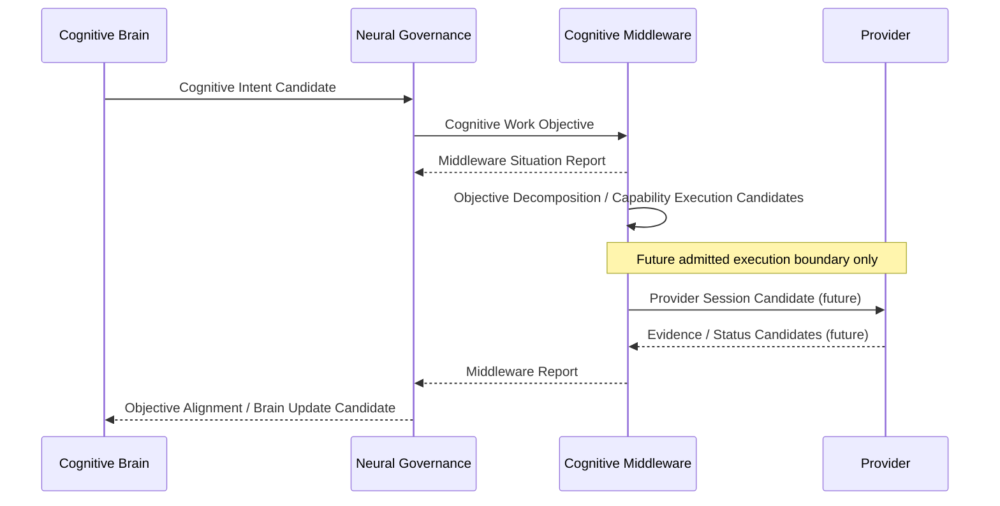

# Neural–Middleware Operating Sequence v1

## Sequence

## Lifecycle interpretation

1. **Intent:** Brain describes what understanding is needed and why.
2. **Work Objective:** Neural translates the intent into CIR with required coverage and constraints.
3. **Situation Report:** Middleware exposes current availability, degradation, resource constraints, and alternatives.
4. **Objective Decomposition:** Middleware creates capability-work candidates; it does not alter cognitive purpose.
5. **Execution boundary:** Future admission/session execution may return evidence/status; no runtime is created here.
6. **Middleware Report:** Middleware reports coverage, gaps, conflict, failure, degradation, and alternatives.
7. **Alignment:** Neural compares report with CWO and emits candidate outcomes.
8. **Brain Update:** Brain integrates the candidate with Context, Attention, Workspace, Evaluation, and sufficiency.

## Fixed boundaries

- Provider never reports directly to Brain.
- Neural never invokes Provider or allocates actual resources.
- Middleware never decides cognitive completion.
- Brain never directly chooses a Provider or executes the work.
- B-route simulation/action remains outside this sequence.
