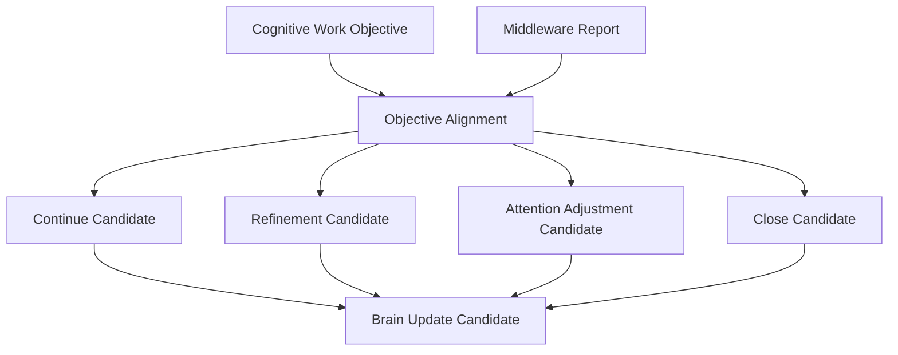

# Neural Objective Alignment Model v1

## Definition

Neural Objective Alignment compares the original CWO with the Middleware Report to determine whether the **information-work contract** appears covered, constrained, conflicted, or incomplete. It produces candidates for Brain consideration; it never directly modifies Brain state.

## Alignment dimensions

| Dimension | Question |
|---|---|
| Purpose preservation | Was the CWO purpose retained without Middleware rewriting? |
| Required-understanding coverage | Which required understanding dimensions were reported covered or missing? |
| Observation/relationship coverage | Which evidence and relation requirements remain incomplete or conflicted? |
| Unknown reduction | Did returned coverage address the declared unknown target? |
| Constraint compliance | Were degradations, availability, and resource limits explicit? |
| Completion condition | Is there a candidate basis to ask Brain whether cognitive sufficiency should be reassessed? |

## Outputs

- `continue_candidate`: more coverage under the same CWO may be useful.
- `refinement_candidate`: wording, scope, relationship, or evidence requirement needs clarification.
- `attention_adjustment_candidate`: a candidate must be submitted back to Attention Governance.
- `close_candidate`: the work objective may be closed as a work lifecycle, subject to Brain assessment.

None of these outputs is a Decision, Action, Truth, Goal change, or direct Brain/Reducer state mutation.
