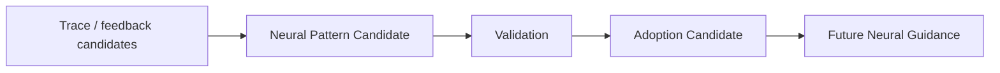

# Cognitive Neural Pattern Evolution Boundary v1

## Purpose

Neural Pattern Evolution captures reusable **organization experience**—for example, which capability-role combinations tended to improve evidence coverage in a class of context—without turning runtime feedback into automatic Neural self-modification.

## Pattern Candidate scope

A candidate may describe:

- useful signal decomposition patterns;
- capability-role complementarity patterns;
- recurring coverage gaps;
- conflict-detection patterns;
- degradation-aware fallback requirements;
- evidence-cost versus information-gain observations.

It must record scope, context assumptions, evidence basis, counterexamples, reliability limits, and trace provenance.

## Boundary rules

- Pattern Candidate ≠ runtime policy mutation.
- Repetition ≠ value.
- Frequency ≠ priority.
- Organization success ≠ truth of returned evidence.
- Experience ≠ attention authority.
- Adoption Candidate does not mutate current Neural state; Reducer remains the sole state-mutation authority.

## Validation and use

Only an external, governed validation/adoption process may admit a pattern for future guidance. Future guidance can influence a Neural Coordination Candidate, but must remain subject to current Brain intent, protocol contracts, Middleware availability, resource constraints, and feedback supervision.

No learning runtime, protocol self-rewrite, model training, or automatic route change is created in this phase.
