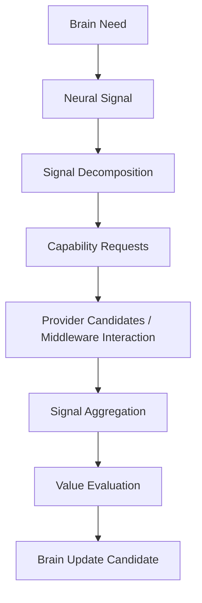

# Cognitive Neural Processing Whitebox v2

## Purpose

Neural Processing Whitebox v2 exposes the full signal-processing chain. It explains why the Brain requested a sense capability, how the signal decomposed, what evidence relations returned, and what update candidate was offered. It is read-only and is not a provider-control console.

## Required panels

| Panel | Displays | Must not do |
|---|---|---|
| Brain Need | goal/context/attention references, unknown, evidence requirement | create/edit goal or attention |
| Neural Signal | source, target, intent, priority, depth, uncertainty, protocol version, trace | direct command/invocation |
| Decomposition | parent/child capability request graph and inherited constraints | choose provider or start session |
| Middleware/Provider | candidate alternatives, admission/resource/reliability/lifecycle state | present provider result as truth |
| Aggregation | consistency, conflict, confidence-support, temporal/spatial alignment | resolve semantics or conflict automatically |
| Value | relevance, information gain, reliability, cost, uncertainty reduction | allocate attention or decide truth |
| Brain Update | candidate references for Context/Workspace/Evaluation | mutate Brain State |

## Trace identity

Each visualized lifecycle must preserve `signal_type`, `source`, `target`, `intent`, `priority`, `depth`, `resource_constraint`, `uncertainty`, `feedback_requirement`, `evidence_ref`, `capability_ref`, lifecycle stage, and trace reference.

## Status

`COGNITIVE_NEURAL_PROCESSING_WHITEBOX_V2_READY_WITH_NOTES`

`WAITING_FOR_USER_TERMINAL_VERIFICATION`
