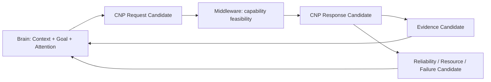

# Cognitive Neural Protocol Concept v1

## Definition

Cognitive Neural Protocol (CNP) is the candidate-oriented information-exchange specification between Luna's Cognitive Brain and Cognitive Middleware. It is **not** an API invocation protocol, RPC schema, device command format, or model-tool calling convention.

It describes what the Brain needs to know and what the Middleware can provide, while preserving uncertainty, provenance, resource limits, and failure visibility.

## Request: Brain → Middleware

| Field | Meaning | Boundary |
|---|---|---|
| `goal_context` | Active Goal Candidate reference and relevant success constraints | Contextual direction, not a command |
| `attention_context` | Allocation / priority / depth / duration candidate | Does not grant hardware control |
| `information_requirement` | What information category is needed | Does not choose a specific model by itself |
| `evidence_requirement` | Required evidence type, scope, freshness, provenance, uncertainty tolerance | Does not assert expected truth |
| `resource_requirement` | Compute, energy, latency, storage, network expectations | Request only; Middleware reports feasibility |
| `priority` | Cognitive urgency/relevance candidate | Priority is not truth or decision authority |
| `confidence_requirement` | Minimum support needed for the intended cognitive use | Not a promise that the result is factual |

### Request invariants

- Request is a Cognitive Request Candidate.
- Request cannot execute a model or hardware device.
- Request cannot mutate State.
- Request cannot authorize action.

## Response: Middleware → Brain

| Field | Meaning | Boundary |
|---|---|---|
| `capability_available` | Capability/provider availability candidate | Availability is not execution confirmation |
| `evidence_candidate` | Unified Evidence Candidate with source, time, scope, confidence, uncertainty, and trace | Evidence is not truth |
| `reliability_state` | Model/device delivery reliability candidate | Reliability is not correctness |
| `resource_state` | Resource availability/constraint candidate | Resource state does not change cognitive goal |
| `failure_candidate` | Explicit capability, delivery, or constraint failure candidate | Failure is not a cognitive conclusion |

### Response invariants

- Middleware may return no evidence and only a failure/constraint candidate.
- Middleware cannot return a Decision, Action, Truth, or Goal override.
- Evidence must preserve source and uncertainty rather than normalizing away disagreement.

## Conceptual exchange

## Protocol evolution rule

New capabilities may add evidence categories or resource descriptors only through future controlled versioning. They must not add fields that convey implicit Decision Authority, Goal Authority, Attention Authority, Truth Authority, or State Mutation permission.

## Status

`COGNITIVE_NEURAL_PROTOCOL_CONCEPT_READY_WITH_NOTES`

`WAITING_FOR_USER_TERMINAL_VERIFICATION`
