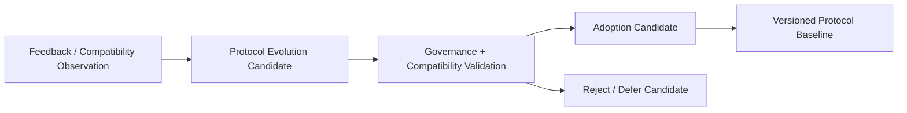

# Cognitive Neural Protocol Evolution Model v1

## Principle

The Neural Protocol is not permanently frozen in every payload detail, but its authority and safety core is frozen. Evolution is governed and candidate-based; a Runtime cannot rewrite the protocol while operating.

## Fixed protocol core

| Fixed element | Reason |
|---|---|
| Signal Type taxonomy | Prevents a model/provider from inventing an authority-bearing signal class. |
| Authority Boundary | Prevents Goal, Attention, Truth, Decision, Action, and State-mutation escalation. |
| Safety Contract | Keeps reflex limited to embodiment protection and prohibits world action. |
| Trace Format requirements | Preserves provenance and inspectability across layers. |

## Evolvable protocol surface

| Evolvable element | Example | Constraint |
|---|---|---|
| Signal Payload | add lens-obstruction severity or OCR layout metadata | Must remain inside existing signal authority/type. |
| Priority Pattern | adjust priority pattern based on validated attention feedback | Priority cannot become fact/decision authority. |
| Routing Preference | prefer OCR over VLM for low-energy text evidence | Preference is a capability candidate, not an automatic call. |
| Capability Preference | declare new provider traits or bundle compatibility | Cannot alter Brain/Middleware boundary. |

## Evolution lifecycle

## Evolution invariants

- `Candidate → Validation → Adoption` is mandatory.
- Runtime self-modification of signal schema, authority boundaries, safety contracts, or trace requirements is forbidden.
- A provider/model cannot introduce a new signal class by returning an unrecognized payload.
- Past trace readability must be preserved through version compatibility or explicit migration records.
- Adoption is not automatic learning and cannot mutate Cognitive Foundation.

## Status

`COGNITIVE_NEURAL_PROTOCOL_EVOLUTION_MODEL_READY_WITH_NOTES`

`WAITING_FOR_USER_TERMINAL_VERIFICATION`
