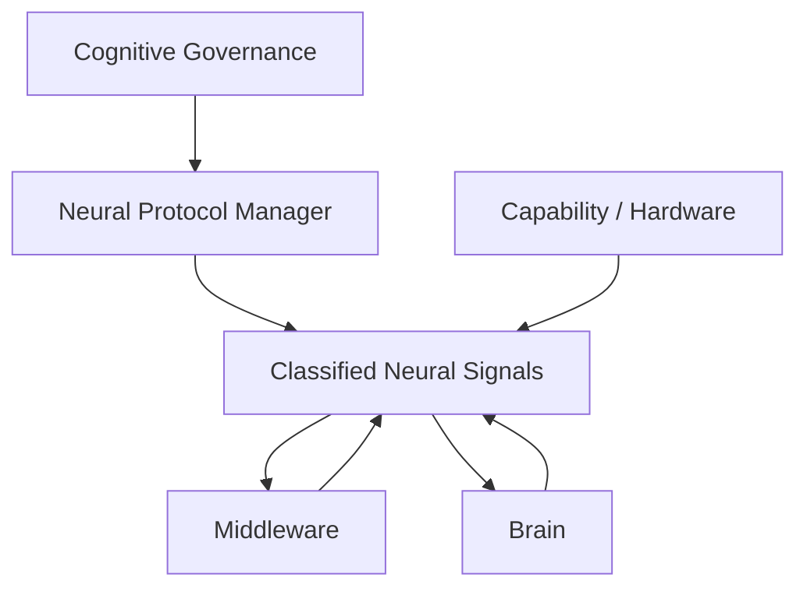

# Neural Protocol Manager Architecture v1

## Position

Neural Protocol Manager is a governance-managed component of the independent Cognitive Neural Architecture. It is not a Middleware module, Model Manager, Hardware Manager, Runtime executor, or Brain decision component.

## Responsibilities

| Responsibility | Description | Output form |
|---|---|---|
| Signal schema management | Define required envelope categories, semantic fields, and candidate constraints | schema/version proposal or compatibility candidate |
| Protocol version management | Maintain conceptual version compatibility across Brain, Middleware, and Body boundaries | protocol version / compatibility candidate |
| Signal classification | Assign/validate signal type, direction, authority envelope, lifecycle, and trace requirements | classification/boundary validation candidate |
| Compatibility validation | Reject or defer incompatible signal forms at a future admission boundary | validation/failure candidate |
| Evolution proposal handling | Receive proposed payload/preference evolution and route it into governance validation | evolution proposal candidate |
| Trace continuity | Require source/destination/provenance/trace linkage across path boundaries | trace completeness candidate |

## Explicit prohibitions

Neural Protocol Manager cannot:

- modify Reality;
- modify Memory;
- modify Decision;
- modify Goal, Attention, Context, Workspace, or Evaluation;
- execute a model, device, or capability;
- mutate Reducer State;
- autonomously adopt a protocol evolution.

## Governance relationship

Cognitive Governance sets immutable authority/safety contracts. Neural Protocol Manager enforces signal-form compatibility with those contracts. It does not replace Governance, and it cannot create new authority through a protocol version.

## Status

`COGNITIVE_NEURAL_PROTOCOL_MANAGER_ARCHITECTURE_READY_WITH_NOTES`

`WAITING_FOR_USER_TERMINAL_VERIFICATION`
