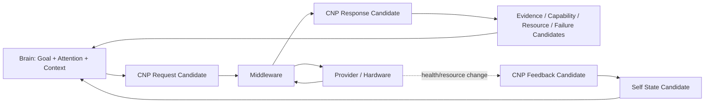

# Cognitive Neural Protocol v1 — Structural Design

## Position

Cognitive Neural Protocol v1 (CNP v1) evolves the prior conceptual protocol into a structured candidate-exchange model. It remains a cognitive/body information specification, not an API, RPC schema, tool-call format, scheduler, or device command protocol.

## Request lane: Brain → Middleware

| Field | Purpose | Required boundary |
|---|---|---|
| `goal_context` | Explains the active goal and success constraints relevant to the evidence need | Goal context is not a command or goal transfer. |
| `active_attention` | Supplies target, priority, depth, direction, and lifecycle reference | Attention context does not authorize a device call. |
| `information_need` | States what category of unknown/relation/state needs support | Does not name a provider as an authority. |
| `evidence_requirement` | Defines source/scope/freshness/provenance/uncertainty/confidence expectations | Does not demand truth confirmation. |
| `duration` | States requested observation mode: one-shot, bounded stream, background health, or diagnostic window | Duration is a cognitive request constraint, not an unconditional lease. |
| `priority` | Declares urgency/relevance candidate | Priority is neither fact nor final resource authority. |
| `resource_constraint` | States latency, energy, compute, network, storage, and reliability needs | Middleware may constrain or reject it through candidates. |

## Response lane: Middleware → Brain

| Field | Purpose | Required boundary |
|---|---|---|
| `capability_candidate` | Feasible provider/bundle/admission/session-binding candidate | Feasible does not mean executed. |
| `evidence_candidate` | Source-scoped, time-scoped, confidence/uncertainty-preserving cognitive evidence | Evidence is not truth. |
| `reliability_state` | Capability/provider/device quality and health candidate | Reliability is not cognitive correctness. |
| `resource_state` | Battery/compute/network/storage/capability budget condition candidate | Resource state cannot overwrite Goal or Attention. |
| `failure_candidate` | Explicit unavailable, degraded, delivery, or admission failure candidate | Failure does not create a new cognitive goal. |

## Asynchronous feedback lane: Middleware → Brain

This lane does not require an active Brain request. It is limited to embodied/capability changes that affect the reliability or availability of evidence provision.

| Feedback field | Example | Brain-facing result |
|---|---|---|
| `capability_state_change` | visual reliability drops from 0.9 to 0.3 | Self State input candidate |
| `resource_state_change` | battery becomes critically constrained | Resource/Self State input candidate |
| `hardware_safety_event` | lens obstruction or thermal protection | reliability/failure/constraint candidate |
| `provider_health_change` | OCR provider becomes unavailable | capability availability/failure candidate |

## Structural flow

## CNP v1 invariants

- All request, response, and feedback elements are candidates with provenance and trace references.
- A response may contain only `failure_candidate` or `resource_state` when no evidence is available.
- Provider-specific payloads remain behind Model Adapter / Hardware Manager until Evidence Gateway packages them.
- CNP cannot express Decision Authority, Action Authority, Truth Authority, Goal Authority, Attention Authority, or State Mutation permission.

## Status

`COGNITIVE_NEURAL_PROTOCOL_STRUCTURE_READY_WITH_NOTES`

`WAITING_FOR_USER_TERMINAL_VERIFICATION`
