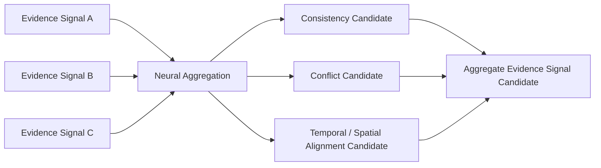

# Neural Signal Aggregation Architecture v1

## Definition

Signal Aggregation receives Evidence Candidates and associated reliability/resource/failure signals after Middleware Evidence Gateway. It structures their relationship for Brain evaluation. It does not make a semantic fact, select an action, or overwrite the current world understanding.

## Aggregation dimensions

| Dimension | Neural operation | Output | Not a conclusion about |
|---|---|---|---|
| Consistency | identify support/contradiction among evidence claims | consistency candidate | truth |
| Conflict | preserve unresolved disagreement and source roles | conflict candidate | which source wins |
| Confidence | retain source confidence and disclose aggregation support | confidence-support candidate | fact probability |
| Temporal Alignment | compare time scope/freshness/order | temporal-alignment candidate | current state truth |
| Spatial Alignment | compare coordinate/reference scope | spatial-alignment candidate | physical object identity |

## Aggregation invariant

Aggregation is **structural evidence organization**. Brain Evaluation determines relevance, applicability, and whether the evidence is sufficient. Current Reality remains external and evidence remains candidate-only.

## Status

`COGNITIVE_NEURAL_SIGNAL_AGGREGATION_READY_WITH_NOTES`

`WAITING_FOR_USER_TERMINAL_VERIFICATION`
