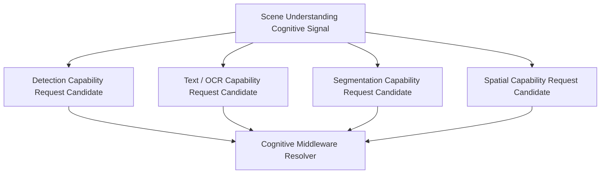

# Neural Signal Decomposition Architecture v1

## Definition

Signal Decomposition converts one bounded Cognitive Signal into one or more **Capability Request Candidates**. It preserves the original intent, constraints, trace, and uncertainty. It does not select providers, invoke models, or decide the cognitive conclusion.

## Scene Understanding example

## Decomposition contract

| Aspect | Required behavior | Forbidden behavior |
|---|---|---|
| Parent signal | preserve source, intent, priority, depth, resource constraint, uncertainty, trace | discard origin or introduce an unrelated task |
| Child requests | specify Sense Domain/Capability requirement and evidence role | name a required model/provider as authority |
| Granularity | split only to support declared evidence needs | unbounded recursive decomposition |
| Constraints | inherit/allocate bounded resource and feedback requirement | allocate cognitive attention or execution budget |
| Provider resolution | hand off child capability requests to Middleware | direct provider interaction |

## Result

Decomposition yields a request graph, not a cognitive plan:

`one Cognitive Signal → capability request candidates → Middleware Resolver → provider candidates`

## Status

`COGNITIVE_NEURAL_SIGNAL_DECOMPOSITION_READY_WITH_NOTES`

`WAITING_FOR_USER_TERMINAL_VERIFICATION`
