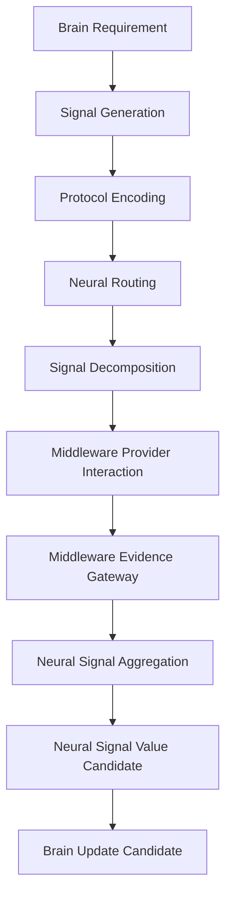

# Cognitive Neural Signal Lifecycle v1

## Purpose

Neural Signal Lifecycle defines how a Brain information requirement becomes bounded capability requests, returns as evidence-bearing signals, is structurally aggregated, and reaches Brain as a Cognitive Update Candidate. It is a signal lifecycle, not a Runtime task loop or a decision/action pipeline.

## Lifecycle stages

| Stage | Owner | Input | Output | Prohibited |
|---|---|---|---|---|
| Brain Requirement | Cognitive Brain | Goal/Context/Attention/Unknown candidates | information/evidence requirement candidate | provider call or decision |
| Signal Generation | Neural Layer | Brain requirement candidate | Cognitive Signal Candidate | Goal/Attention rewrite |
| Protocol Encoding | Neural Layer | signal candidate | versioned envelope / boundary validation candidate | Decision/Action/Truth fields |
| Routing | Neural Layer | encoded signal | target Middleware path candidate | provider selection or execution |
| Decomposition | Neural Layer | bounded cognitive signal | Capability Request Candidates | new cognitive goal or provider call |
| Provider Interaction | Cognitive Middleware | capability requests + governance constraints | provider/session/constraint candidates | cognitive evaluation/decision |
| Evidence Gateway | Cognitive Middleware | provider raw output and metadata | Evidence Candidate | truth confirmation |
| Aggregation | Neural Layer | evidence signals | aggregate/alignment/conflict candidates | semantic fact fusion |
| Value Evaluation | Neural Layer | aggregate/requirement/resource/reliability candidates | signal-value candidate | Truth or Attention authority |
| Brain Update Candidate | Neural → Brain boundary | value/evidence/conflict/feedback candidates | Context/Workspace/Evaluation input candidate | direct state/context/workspace mutation |

## Lifecycle invariant

Provider interaction is not owned by Neural Layer. It crosses Neural routing into Middleware, then returns through Evidence Gateway before Neural aggregation. Every stage remains candidate-only and traceable.

## Status

`COGNITIVE_NEURAL_SIGNAL_LIFECYCLE_READY_WITH_NOTES`

`WAITING_FOR_USER_TERMINAL_VERIFICATION`
