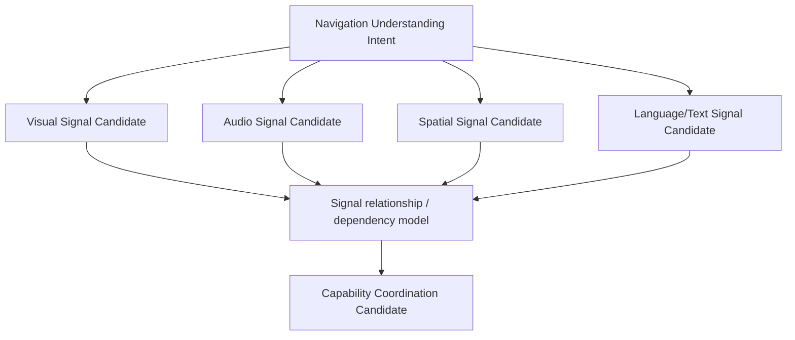

# Cognitive Neural Signal Organization Model v1

## Purpose

Signal Organization creates a coherent candidate set from a single Cognitive Intent without requiring every capability to act or allowing a capability to set the cognitive agenda.

## Organization attributes

| Attribute | Meaning | Boundary |
|---|---|---|
| Signal priority | Requested order/urgency based on parent intent and constraints. | Not a final Attention allocation. |
| Signal dependency | Evidence relationship such as “spatial relation needs entity references.” | Not a provider execution order. |
| Signal relationship | Reinforcement, complementarity, conflict sensitivity, or optionality. | Not a truth rule. |
| Scope | Temporal, spatial, contextual, and task-local evidence limit. | Cannot widen a Brain goal. |
| Depth | Requested evidence understanding depth. | Cannot force resource allocation. |

## Example

For navigation understanding, the organization may request visual structure, audio risk clues, spatial relations, and traffic-text evidence. The resulting set expresses needed coverage only. Middleware decides which feasible Capability Candidate Set can answer it under Registry, admission, session, and resource constraints.

## Prohibitions

Signal Organization must not directly call a capability, select a Provider, allocate compute/power, mutate attention, decide cognitive completion, or open B-route simulation.
