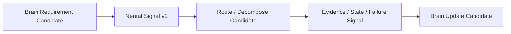

# Cognitive Neural Signal Protocol v2

## Position

Neural Signal Protocol v2 is the conceptual envelope for lifecycle-stage signals. It extends the signal description for decomposition, aggregation, feedback, and trace without changing any implemented protocol or runtime contract.

## Required fields

| Field | Meaning | Boundary |
|---|---|---|
| `source` | originating layer/module/candidate reference | source does not grant authority |
| `target` | intended boundary recipient | target does not permit mutation |
| `intent` | bounded information/evidence/feedback purpose | not a Goal or decision |
| `priority` | requested relevance/urgency candidate | priority ≠ truth/value authority |
| `depth` | requested processing/composition depth candidate | not an unlimited reasoning grant |
| `resource_constraint` | latency/compute/memory/network/energy limits | constraint cannot rewrite goal/attention |
| `uncertainty` | known unknowns, source limits, alignment/conflict state | uncertainty is not failure or truth |
| `trace` | lineage, protocol version, lifecycle, provenance references | trace is not State |
| `feedback_requirement` | whether reliability/resource/failure/completion feedback is needed | does not create a session itself |

## Forbidden fields

Signal must not contain:

- `Decision`;
- `Action`;
- `Truth`;
- State mutation instruction;
- Goal override;
- Attention allocation command;
- direct model/hardware invocation command.

## Protocol envelope

## Version rule

New payload attributes may be proposed only through the existing Neural Protocol evolution governance. Signal type, authority boundary, safety contract, and trace requirements remain fixed unless a separately governed adoption process changes them.

## Status

`COGNITIVE_NEURAL_SIGNAL_PROTOCOL_V2_READY_WITH_NOTES`

`WAITING_FOR_USER_TERMINAL_VERIFICATION`
