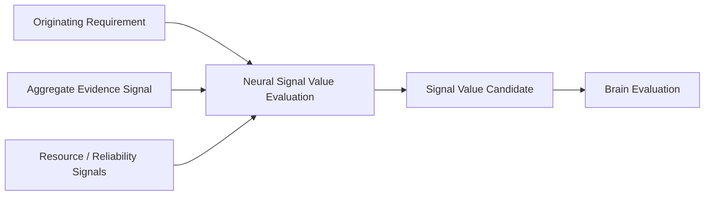

# Neural Signal Value Evaluation v1

## Scope

Neural Signal Value Evaluation measures the operational usefulness of a signal/aggregate for routing and feedback transparency. It produces a `Signal Value Candidate`; it does not replace Cognitive Brain Evaluation and never decides truth.

## Value dimensions

| Dimension | Question | Boundary |
|---|---|---|
| Relevance | Does this aggregate address the originating information/evidence requirement? | relevance ≠ goal authority |
| Information Gain | Does it add distinction beyond current supplied evidence? | gain ≠ truth |
| Reliability | Are provider/evidence delivery conditions disclosed and within requested tolerance? | reliability ≠ correctness |
| Resource Cost | What compute/memory/latency/network/energy cost was requested or observed? | cost ≠ cognitive budget authority |
| Uncertainty Reduction | Does it narrow an explicitly declared unknown/conflict? | reduction ≠ certainty |

## Boundary

`Value ≠ Truth.`

Signal Value Candidate may state that a response is low relevance, costly, unreliable, or reduces little uncertainty. Brain Attention/Evaluation may consume that candidate under normal governance; Neural Layer cannot change Attention allocation or decide whether to continue thinking.

## Status

`COGNITIVE_NEURAL_SIGNAL_VALUE_EVALUATION_READY_WITH_NOTES`

`WAITING_FOR_USER_TERMINAL_VERIFICATION`
