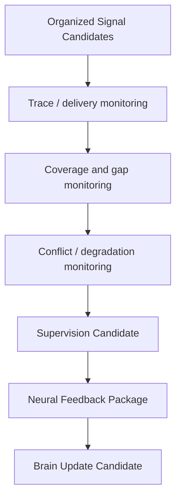

# Cognitive Neural Supervision Model v1

## Purpose

Neural Supervision observes whether the information-acquisition organization is coherent, traceable, and sufficiently covered for feedback to the Brain. It supervises signal integrity, not the world, a decision, or a physical action.

## What Neural supervises

| Supervision target | Candidate result |
|---|---|
| Signal transmission completeness | Missing/invalid/routed completion candidate. |
| Return coverage | Coverage-gap or relation-gap candidate. |
| Trace/provenance continuity | Trace-integrity candidate. |
| Conflict visibility | Conflict-escalation candidate. |
| Degradation/failure visibility | Capability limitation candidate. |
| Need for continued observation | Continue/refine/change-attention candidate. |

## What Neural does not supervise

- Whether a world statement is true.
- Whether an action is correct.
- Whether a decision should be adopted.
- Provider execution itself, model invocation, or device control.
- Actual compute, battery, memory, or network allocation.
- Reducer or Runtime state.

## Supervision boundary

When a signal is incomplete, Neural may emit a refinement, fallback-requirement, conflict, or unresolved-unknown candidate. Middleware determines whether a feasible capability/session response exists. Brain determines whether the remaining gap matters for cognitive sufficiency. Neither response creates a direct action or state-mutation path.
