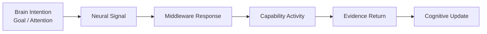

# Cognitive Neural Whitebox Architecture v1

## Purpose

Cognitive Neural Whitebox makes the neural exchange visible as a signal system. It explains why and how evidence moves between Brain, Middleware, and Capability without reducing observability to a model-call log.

## Trace object model

| Trace object | Required view fields | Boundary |
|---|---|---|
| Neural Signal Trace | signal reference/type, source, destination, direction, lifecycle, authority envelope, provenance, trace reference | Does not expose a manual authority override. |
| Signal Timeline | creation, transport, receive, update, reduce/suspend, close events | Timeline is observational, not a scheduler. |
| Signal Priority | requested/allocated priority, depth, duration, reduction reason | Priority is not truth/value confirmation. |
| Signal Source/Destination | Brain, Neural Layer, Middleware, Provider/Hardware boundary identifiers | Source is not decision ownership. |
| Capability Session Trace | request, bind, reliability/resource events, evidence returns, close/suspend candidates | Does not invoke or close a session from UI. |
| Reflex / State Trace | local safety, health, resource, and feedback candidates | Does not issue a world action. |

## Planned local web visualization

## Whitebox panels

1. **Intention panel:** Goal Context, active Attention, information/evidence requirement, and unknown reason.
2. **Signal timeline panel:** ordered cognitive/perception/reflex/simulation signals with priority and lifecycle.
3. **Middleware panel:** capability alternatives, resource/reliability constraints, and session status.
4. **Evidence panel:** evidence source, time, scope, confidence, uncertainty, conflict, and trace.
5. **Feedback panel:** Capability State Change / Resource / Reflex signals and resulting Self State or Attention adjustment candidates.
6. **Compatibility panel:** protocol version, signal classification result, boundary validation, and rejected/deferred signals.

## Whitebox boundary

The Whitebox is future local read-only observation. It cannot create signals, edit priority, choose providers, invoke hardware/models, close sessions, approve truth, or mutate State. Existing Model Test Lens remains a migration candidate for this projection-only role.

## Status

`COGNITIVE_NEURAL_WHITEBOX_ARCHITECTURE_READY_WITH_NOTES`

`WAITING_FOR_USER_TERMINAL_VERIFICATION`
