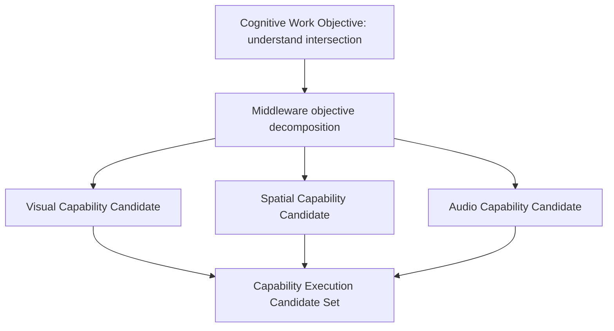

# Cognitive Objective Decomposition Model v1

## Purpose

Objective Decomposition is the Middleware-side transformation of a CWO into bounded **capability-work candidates** that can be evaluated against Registry, admission, Provider status, and resource constraints. It is execution organization, not cognitive-goal design.

## Decomposition rules

1. Preserve CWO purpose, scope, required-understanding, unknown target, completion condition, and trace.
2. Map evidence/relationship requirements to capability roles, never to a new cognitive Goal.
3. Surface constraints, dependencies, alternatives, and partial-coverage outcomes explicitly.
4. Produce candidates only; no capability is automatically executed by this model.
5. Return a refinement request where the CWO is ambiguous or infeasible rather than inventing its meaning.

## Example

For “understand intersection,” candidate work may include visual evidence coverage, spatial relationship coverage, and audio risk-evidence coverage. Middleware cannot redefine the objective as “find restaurants,” decide crossing safety, or generate movement/action instructions.

## Boundary

`CWO decomposition ≠ Task Plan`  
`Capability candidate ≠ Provider execution`  
`Middleware alternative ≠ cognitive-goal override`
