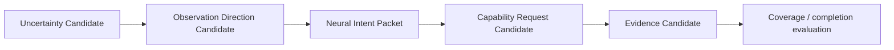

# Cognitive Observation Direction Model v1

## Definition

Observation Direction describes the **information perspective or relation coverage required** to reduce a current unknown. It is an evidence-acquisition constraint for capability organization; it is not a physical orientation or movement command.

Examples:

| Observation-direction candidate | Meaning | Allowed downstream effect |
|---|---|---|
| `front_road_structure_required` | Current evidence lacks a sufficiently informative forward road structure view. | Request a capability candidate able to provide relevant visual/spatial evidence. |
| `side_view_insufficient` | Current side-oriented evidence does not cover the required relation. | Mark coverage gap and request complementary evidence. |
| `spatial_relationship_required` | Entity recognition alone is insufficient; relative locations are needed. | Add a spatial-understanding requirement. |
| `temporal_continuity_required` | A single observation is insufficient to assess change. | Request bounded temporal evidence continuity. |

## Flow

## Boundary contract

Observation direction may guide:

- evidence scope;
- required relation coverage;
- capability requirements;
- evidence quality and depth expectations.

Observation direction must not directly control:

- Camera hardware;
- body orientation;
- body movement;
- actuator command;
- a provider invocation;
- any Reality state.

If a future embodiment system needs physical repositioning to improve an observation, it must originate from a separately governed B-route action/body-model candidate. This A-route architecture neither creates nor executes that candidate.

## Sufficiency relation

“Front view required” does not mean a front view is true, available, or sufficient. It only records a current information gap. Completion remains a candidate produced after evidence and Neural quality/value evaluation, with Brain-level cognitive sufficiency assessment remaining separate.
