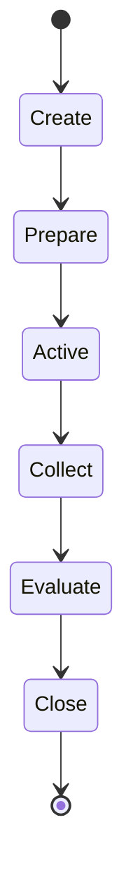

# Cognitive OCR Capability Session Integration v1

## Session scope

The OCR capability session is a traceable temporary Candidate sequence for one fixed image and one `text_understanding` requirement. It is not a Runtime process, a scheduler job, a persistent memory record, or a model-management lifecycle.

## Stage meaning

| Stage | Candidate-only meaning |
|---|---|
| Create | A capability-session record is proposed. |
| Prepare | The requirement is prepared for bounded invocation. |
| Active | The Adapter is permitted to collect from the fixed fixture. |
| Collect | Provider output is available for Evidence adaptation. |
| Evaluate | The session records evidence review, without cognitive completion authority. |
| Close | The bounded session is closed against its evaluation candidate. |

## Trace requirements

The real OCR trace records CWO, capability requirement, selected provider, fixture, provider output, provider status, Evidence output, Middleware report, Neural feedback, and all six lifecycle stages. The trace contains no Reality confirmation, Decision, Action, or state mutation.

## Lifecycle authority

Middleware owns the session-candidate sequence. It does not own goal selection, attention selection, truth, cognitive sufficiency, or final completion. Neural feedback may say information remains missing; only the Brain-side boundary can later form a further cognitive update candidate.
