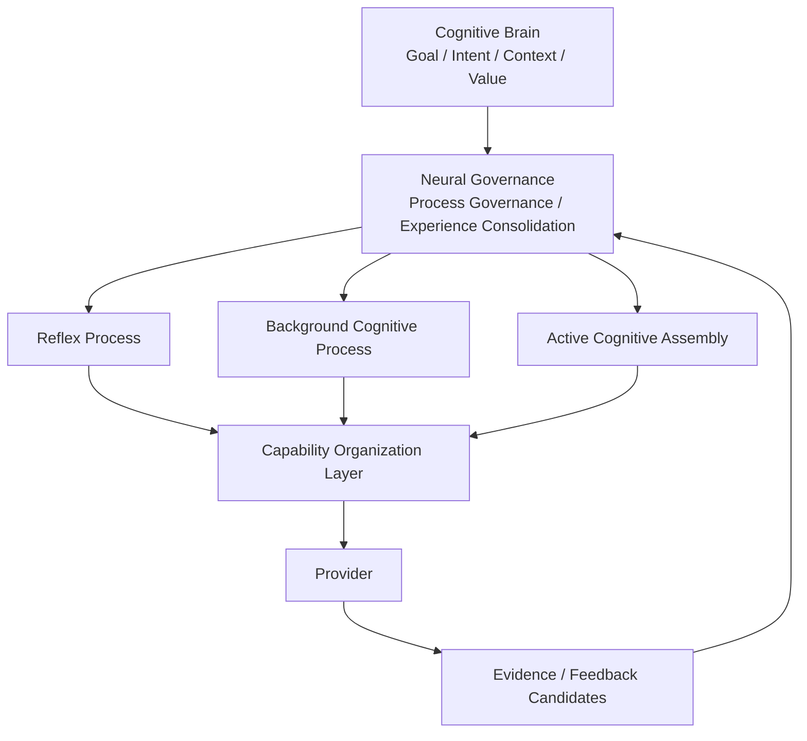

# Cognitive Process Ecology Architecture v1

## Purpose

Cognitive Process Ecology defines how one Cognitive Brain can retain, activate, reduce, and close multiple bounded cognitive processes. A Process is a cognitive loop, not a Task, Agent, autonomous subject, or execution engine.

## Process authority

A Process may hold lifecycle, resource profile, attention relation, capability requirement, and feedback channel references. It may not own Goal, Memory, Personality, Truth, Decision, Action, or State Mutation authority.

Neural Governance manages process candidates and inter-process communication. Middleware organizes capability candidates only. Provider output remains evidence only.
