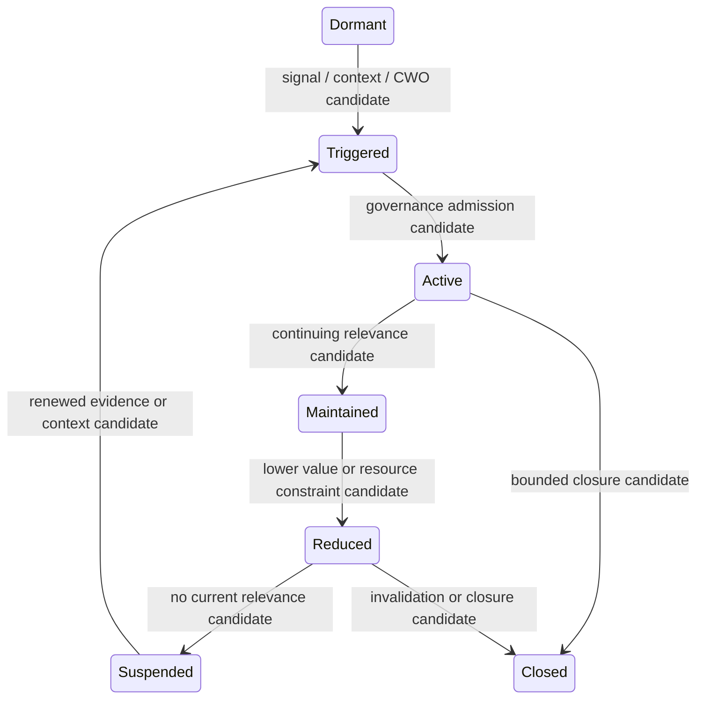

# Cognitive Process Lifecycle Model v1

Every transition is a candidate and remains Reducer-free. Time is not a sole expiration rule: Goal relevance, risk, unknown impact, expected value, and resource cost are considered. No Process may become permanently active by default.
