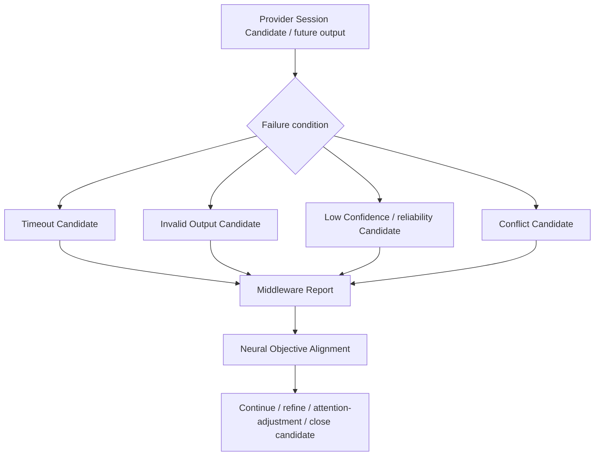

# Provider Failure Handling Model v1

## Purpose

Provider failure handling preserves the evidence/control boundary when a future invocation cannot provide usable coverage. Failure is reported and aligned; it never becomes a hidden retry, cognitive conclusion, or system-wide mutation.

## Failure contract

| Condition | Middleware report content | Forbidden response |
|---|---|---|
| Timeout | Session status, elapsed constraint, missing coverage, fallback candidate. | Silent retry or goal cancellation. |
| Invalid output | Provider/version/schema mismatch, provenance failure, rejected evidence candidate. | Accepting malformed output as evidence. |
| Low confidence | Reliability/uncertainty metadata and partial coverage. | Treating confidence as truth or automatic failure. |
| Conflict | Conflicting evidence references, temporal/spatial scope, unresolved unknown. | Selecting a factual winner without Brain/Evaluation. |
| Provider unavailable/degraded | Lifecycle/resource/health condition and alternative candidate. | Changing CWO purpose or Attention. |

## Boundary

Middleware manages execution-side failure reporting and alternatives. Neural supervises objective alignment. Brain evaluates cognitive sufficiency. No failure type may directly invoke a Provider, create action, mutate state, or modify Memory/Experience in this phase.
