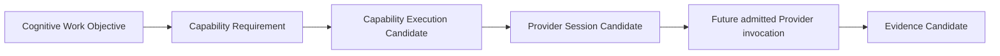

# Controlled Provider Invocation Contract v1

## Phase

`Phase-Cognitive-Controlled-Provider-Invocation-Architecture-v1-001`  
Execution mode: V0 — contract planning only; no Provider invocation is authorized.

## Purpose

This contract defines the future controlled boundary by which Cognitive Middleware may request a Provider after a Cognitive Work Objective has been translated into a Capability Requirement and resolved into a Provider Candidate.

## Preconditions

Before a future Provider invocation can be admitted, the request must carry:

- a CWO reference and immutable purpose/scope trace;
- a Capability Requirement derived from Middleware objective decomposition;
- an eligible Provider Candidate under Registry, Admission, Contract, Lifecycle, and Protocol checks;
- resource/reliability/availability constraints;
- a Provider Session Candidate with bounded lifecycle;
- declared expected Evidence Candidate form and failure-report path.

## Contract roles

| Layer | Contract role | Forbidden role |
|---|---|---|
| Brain | Originates intent; receives Brain Update Candidate only. | Direct Provider/model invocation. |
| Neural | Translates/supervises CWO and feedback. | Execution, selection, resource enforcement. |
| Middleware | Resolves capability/provider/session candidates and future admission request. | Cognitive completion, truth, goal/attention authority. |
| Provider | Future bounded local execution and output return. | Direct Brain communication or semantic authority. |
| Evidence Gateway | Packages output into Evidence Candidate. | Truth, decision, action, state mutation. |

## Frozen rules

- `Provider Session Candidate ≠ Provider invocation`.
- `Provider output ≠ Reality`.
- `Capability Requirement ≠ model name`.
- No Brain or Neural layer may call a Provider.
- A failed, unavailable, or degraded request returns a candidate/report; it never bypasses the contract.
