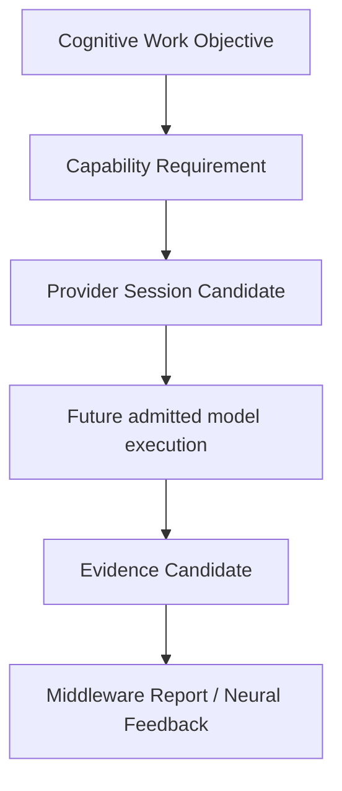

# Provider Invocation Rearchitecture v1

## Target invocation boundary

## Replacement of the legacy path

`Input → Model → Output` is replaced by `CWO → capability requirement → Provider Session Candidate → bounded provider output → Evidence Candidate → feedback`.

## Provider-family mapping

| Future provider family | CWO-derived capability requirement | Expected bounded output |
|---|---|---|
| OCR | Visual text understanding/evidence requirement. | Text Evidence Candidate with provenance/confidence. |
| VLM | Scene/relationship understanding support requirement. | Scene/relationship Evidence Candidate. |
| SAM / Grounded SAM | Region/object/segmentation support requirement. | Region/object Evidence Candidate. |
| SLAM / spatial | Spatial relation/mapping evidence requirement. | Spatial Evidence Candidate. |
| ASR | Audio speech/text evidence requirement. | Speech/Audio Evidence Candidate. |

## Controls

- Middleware, not Brain/Neural, resolves eligible Provider candidates.
- Provider Session remains candidate-only until a separately approved controlled invocation phase.
- Provider outputs are never Reality, Goal, Decision, or Action.
- Multi-provider composition must be justified by CWO coverage needs and returned through Middleware Report, not by a model-first chain.

No invocation implementation, model connection, or session Runtime is introduced here.
