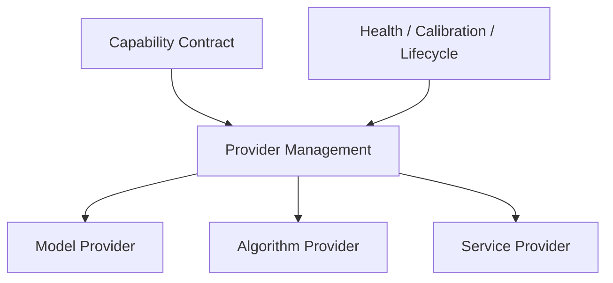

# Provider Management Architecture v1

## Definition

Provider Management is the Software Capability Governance function that manages concrete implementations capable of serving a Capability Contract.

Provider classes:

- Model;
- Algorithm;
- Service.

## Provider responsibilities

| Responsibility | Provider Management output | Forbidden authority |
|---|---|---|
| Registration/reference | provider identity and compatible capability binding candidate | Goal authority |
| Admission/lifecycle lookup | eligible/available/degraded provider candidate | Attention authority |
| Contract compatibility | input/output/scope compatibility candidate | Decision authority |
| Resource/reliability visibility | resource/reliability/failure candidate | Truth authority |
| Alternate provider support | provider alternative / fallback candidate | automatic invocation |

## Frozen rule

Provider Management cannot create a task because an attractive model exists. It cannot decide what Luna should attend to, decide which world interpretation is correct, or directly execute a provider. It supplies governed provider alternatives to Sense Capability Resolver only.

## Status

`COGNITIVE_PROVIDER_MANAGEMENT_ARCHITECTURE_READY_WITH_NOTES`

`WAITING_FOR_USER_TERMINAL_VERIFICATION`
