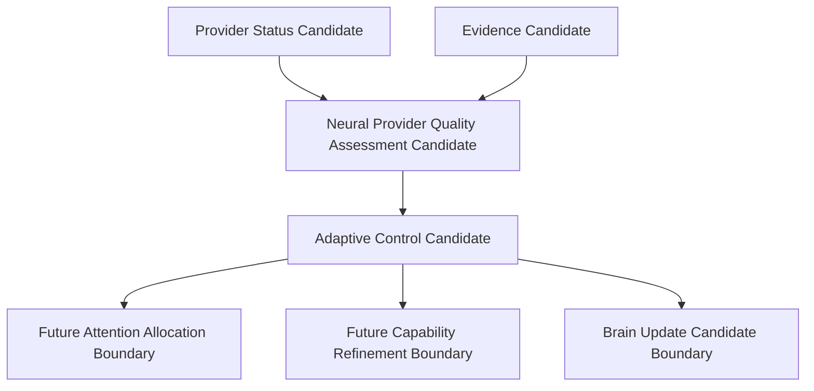

# Cognitive Provider Quality and Adaptive Control Architecture v1

## Phase

`Phase-Cognitive-Provider-Quality-Adaptive-Control-v1-001` is a V1 controlled skeleton phase. It validates that a real Provider's bounded status can inform the next Neural guidance candidate without granting Provider, Neural, or Middleware cognitive authority.

## Chain

`Adaptive Control Candidate` is a recommendation only. It does not call the Attention Controller, create an allocation, invoke a second Provider, close a CWO, create a decision, or modify state.

## Candidate policy

| Observed Provider condition | Neural quality candidate | Proposed next guidance |
|---|---|---|
| Available, high quality, no failure pattern | `provider_quality_sufficient_candidate` | Maintain current text attention. |
| Text present but fallback/degradation observed | `provider_quality_degraded_candidate` | Increase observation depth; propose region-understanding and alternate-text-provider candidates. |
| No text result or Provider unavailable | `provider_unusable_for_current_observation_candidate` | Retain unknown-text attention; propose alternative observation candidates. |

The last row never means text is absent in Reality. It means the current bounded observation is insufficient.

## Boundaries

- Provider Status is an observation candidate, not provider reliability truth.
- Neural assesses signal usefulness; it does not alter an actual Attention allocation.
- Capability refinements are Middleware-facing candidates, not model calls or provider selection.
- Middleware continues to report execution evidence only; it does not determine cognitive sufficiency.
- No A/B Route expansion, Scheduler, Runtime, Decision, Action, State mutation, camera, UI, or Provider re-invocation is introduced.
